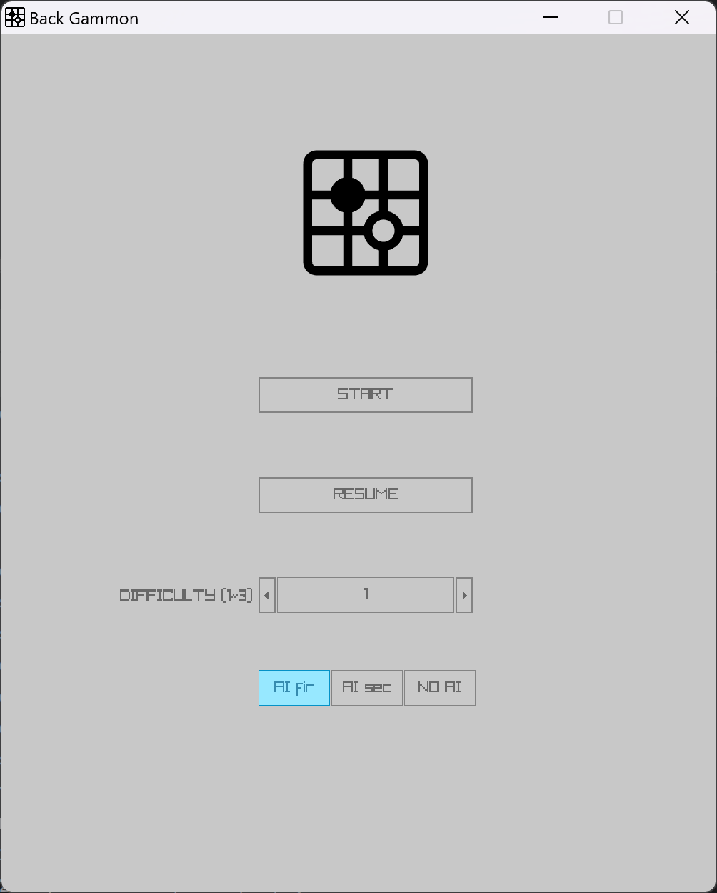
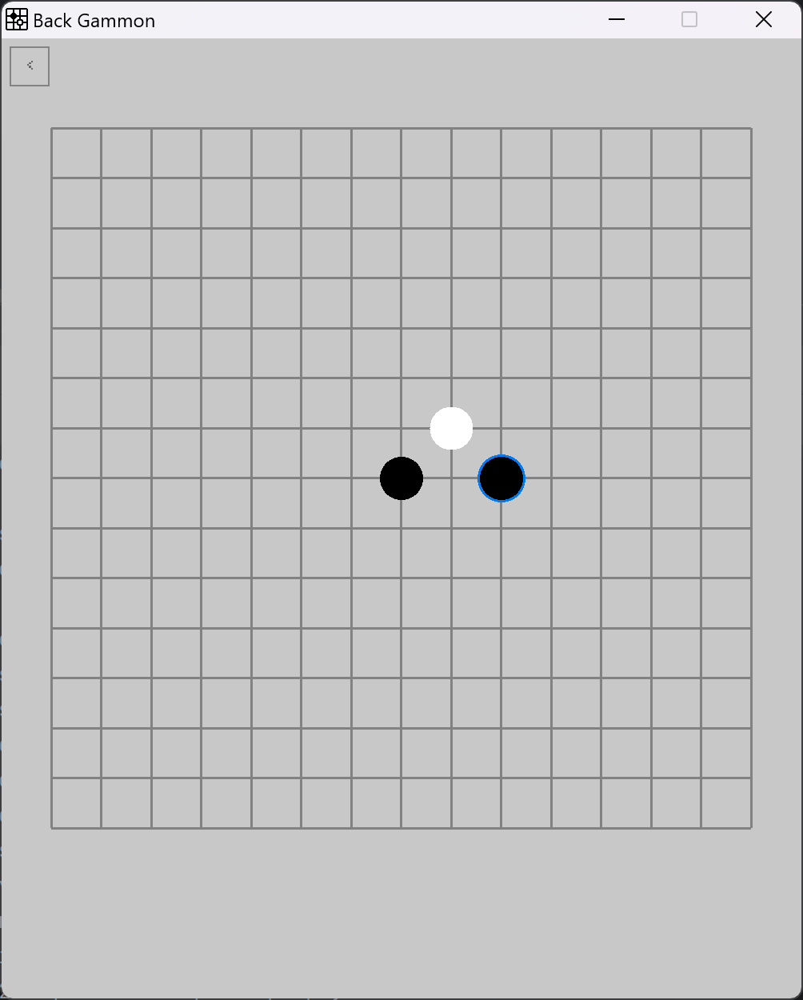
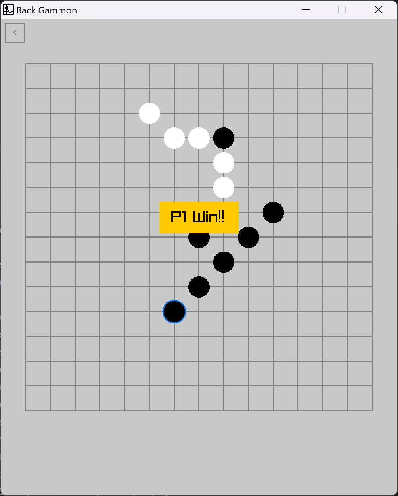
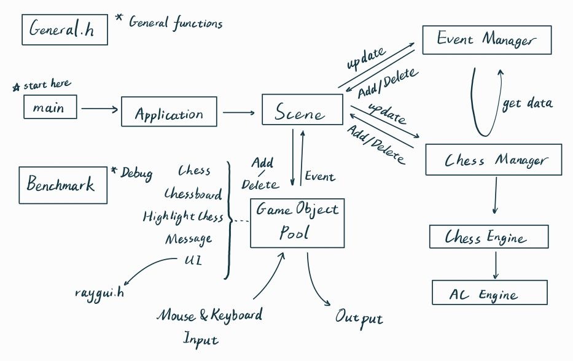
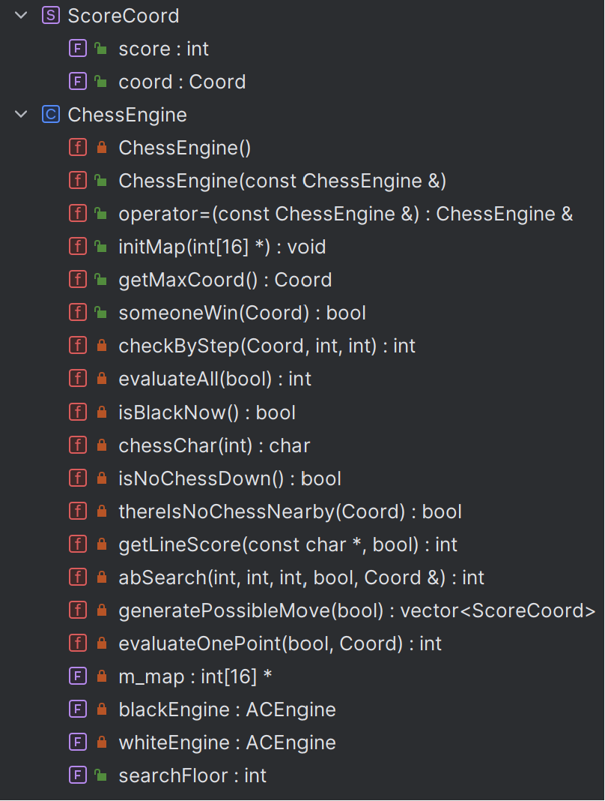
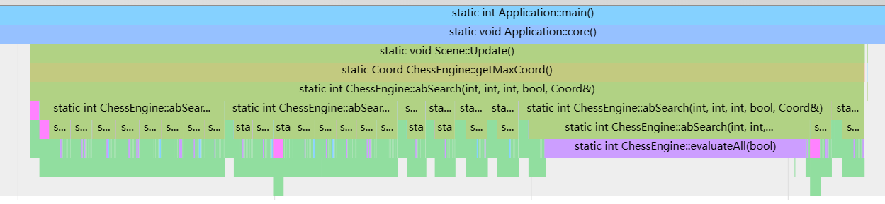
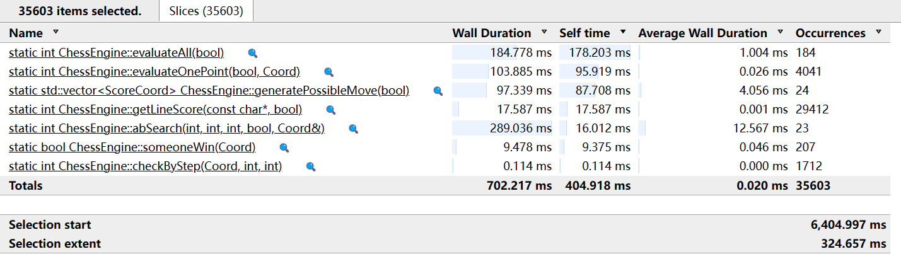
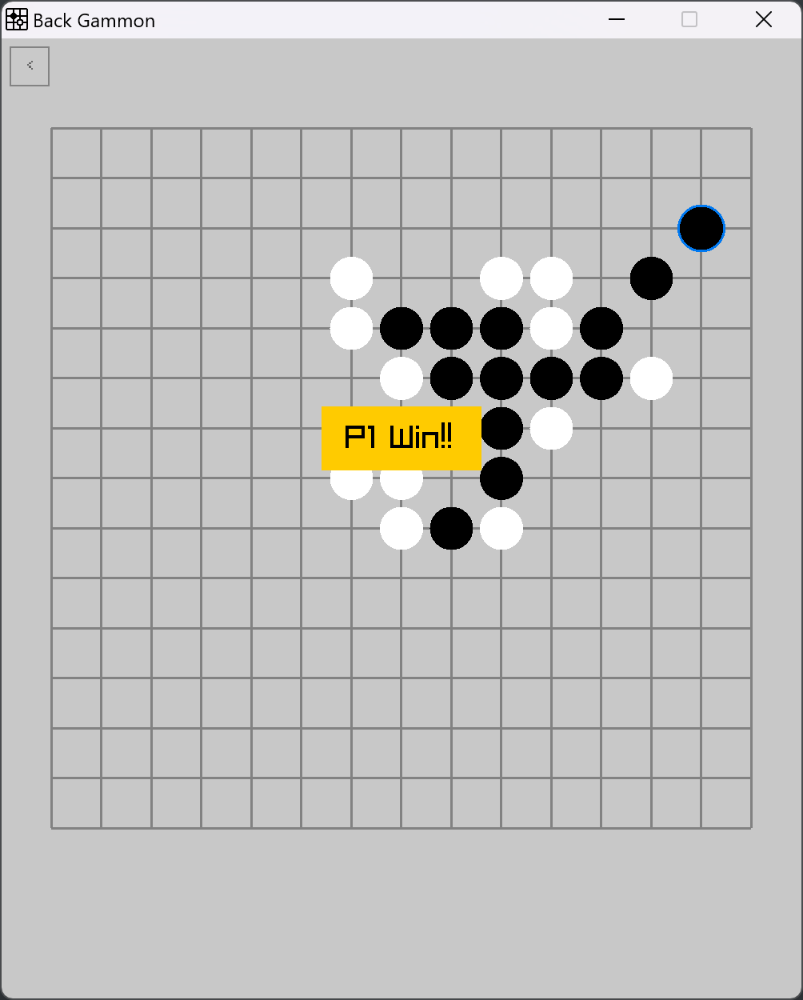
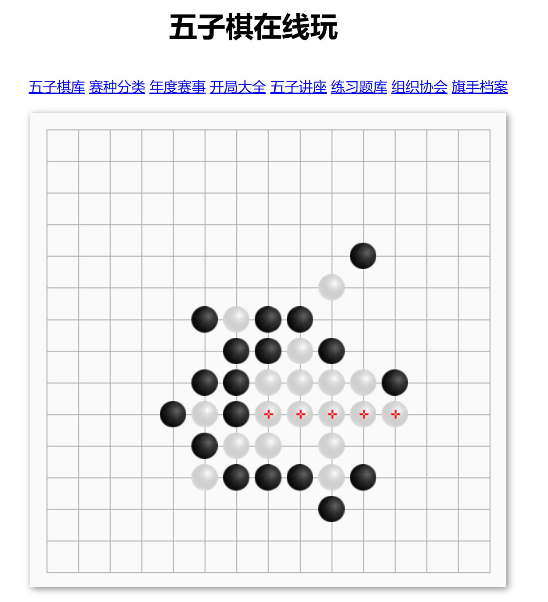

# AI五子棋

## 需求

1. **用户界面（UI）**：
   - **直观的界面设计：** 界面应简洁、直观，使用户能够轻松理解和使用。
   - **棋盘显示：** 清晰的棋盘显示，支持标识当前棋局状态和最新下棋的位置。
2. **游戏模式**：
   - **人机对战：** 提供与计算机AI进行对战的功能，AI应具有不同难度级别，以满足各种玩家水平。
   - **双人对战：** 允许两名玩家在同一设备上进行对战。
3. **AI算法**：
   - **启发式搜索：** 使用启发式搜索算法实现人机对战的AI，以确保对战的挑战性。
   - **可调难度级别：** 提供不同难度级别的AI，以满足初学者到高级玩家的需求。
4. **数据存储**：
   - **游戏记录：** 自动保存对战记录，以便玩家可以回顾和分享。
5. **用户交互**：
   - **棋盘交互：** 提供简便的方式让玩家在棋盘上选择和落子。
   - **撤销和悔棋：** 允许玩家悔棋，提高用户体验。
   - **切换黑白子：** 允许玩家在游玩的时候“前进一步”，达到“解残局”的游玩方式。


## 程序外观

### 主界面



### 游戏界面



### 胜利界面



### 操作方式

- 鼠标点按（符合直觉的）
- 方向左键：撤回（隐藏功能 不提示用户）
- 方向右键：电脑帮忙下一个子（在人机对战的情况下）（隐藏功能 不告诉用户）


## 设计

整个设计采用类来划分功能



- **Application** 实现了对整个应用程序的生命管理，包括对窗口初始化的执行和窗口关闭的类的销毁
- **Scene** 实现对整个场景的绘画任务，是程序运作的核心部位，我将仔细讲解：
  - 它首先接受来自Application的更新和绘画的任务
  - 然后在自身管理的对象池里有优先级的更新对象，同时收集event和实时添加对象
  - 遍历完后开始处理event，将控制权移交给eventManager，同时接受来自eventManager的修改对象的请求
  - 处理完event后就开始按顺序绘画
- **EventManager** 是一个处理event的函数，实现统一化管理决策，内部指令具有优先级保证功能的正确性
- **ChessManager** 是一个管理棋盘的的类，主要储存一系列棋盘的状态方便scene修改对象和帮助eventManager决策
- **ChessEngine** 是主要的游戏引擎，所有需要对棋子进行计算分数或者统计信息的操作都在这里完成
- **AC Engine** 是AC自动机算法的引擎，处理多模式字符串匹配加速估值
- **GameObject Pool** 里面的所有对象都继承自`GameObject` 具有可绘画和可更新的特征，其中UI借用了第三方库RAYGUI完成UI的绘制
- **Benchmark** 是测试用类，用来统计每个函数的用时来优化程序结构


## 实现


## 框架的搭建

最初的想法和现在差不多，考虑游戏围绕update&draw运行，不过event的解耦始终非常困难，因为其中的决策又要用到很多棋盘的信息，不能只靠一个event触发就无脑运行一个功能（如悔棋）

于是一开始设计成Scene决策和绘画一体的模式

```c++
void Scene::Update() {
    if (!IsWindowsStatic) {//窗口能获取信息
        if (cnt % 2) {//到电脑下了
            ...
            return;
        }

        if (IsMouseButtonPressed(MOUSE_BUTTON_LEFT)) {
            ...

            if (SomeoneWin(roundVec)) {
                m_gameObjects.push_back(new Message(cnt % 2 ? "P1 Win!!" : "P2 Win!!"));
                IsWindowsStatic = true;
            }
            return;
        }

    }
}
```

很明显，非常混乱不利于debug，于是小修一下包装了功能

```cpp
void Scene::Update() {
    if (IsWindowsStatic) return;
    if (isWantToCancel()) {
        cancelOneStep();
        if (haveComputerHere()) {
            cancelOneStep();
        }
    }
    if (isWantToSwitchPlayer()) {
        switchPlayer();
    }
    if (isComputerNow()) {
        computerDownOneStep();
    }
    if (isHunanNow() and isPlayerClickOnBoardAndValid()) {
        humanDownOneStep();
    }
    if (someoneWin()) {
        IsWindowsStatic = true;
        showWinMessage();
    }
}
```

这个在单单棋盘界面的时候是没有问题的，但是一旦加进来主菜单的时候就会非常混乱了

所以又把event请回来了，同时为了方便把eventManager、chessManager和Scene都弄成单例的模式

后来发现多此一举，又全部弄成静态的方法来管理

最后就变成了这样的：

```cpp
void Scene::Update() {
    for (GameObject *obj: m_gameObjects) {
        if (obj->m_isActive) {
            EventManager::AddEvent(obj->Update());
        }
    }
    if (EventManager::IsGaming()) {
        EventManager::AddEvent(ChessManager::update());
    }
    EventManager::Update();
}
```

因为所有能够画出来的对象都有统一的接口，所以绘画非常的方便。

之后update就交给EventManager来决策了，那么信息如何传递呢，我用的是enum枚举：

```cpp
enum Event {
    EVENT_NONE = 0,
    EVENT_IS_WANT_TO_RETURN_TO_MAIN_MENU = 1,
    
    ...
        
    EVENT_SET_GAME_MODE_AI_SECOND = 210,
    EVENT_SET_GAME_MODE_NO_AI = 211,
};
```

任何一个出现在游戏里的对象都能够通过update返回一个event来激活一个事件。而这个event最终会传递eventManager处理。eventManager把event统一暂存（优先队列）再统一处理。

eventManager的处理：

```cpp
void EventManager::Update() {
    while (!m_eventQueue.empty()) {
        Event event = m_eventQueue.top();
        m_eventQueue.pop();
        switch (event) {
            case EVENT_IS_WANT_TO_CANCEL:
                cancelOneStep();
                if (!ChessManager::thereIsNoComputer()) {
                    cancelOneStep();//人机对战模式撤回两次
                }
                break;
                
            ...
                
            case EVENT_IS_WANT_TO_RETURN_TO_MAIN_MENU:
                ChessEngine::searchFloor = 3;
                ChessManager::computerIsPWhat = 1;
                IS_GAMING = false;
                IS_GAME_OVER = false;
                Scene::m_gameObjects.clear();
                Scene::AddObject(new UI);
                ChessManager::saveState();
                ChessManager::clear();
                break;
            case EVENT_NONE:
                break;
        }
    }
}
```

这样便很好的分离了决策和绘画的功能，并且加强了程序的扩展性。


## 核心算法模块 ChessEngine

一开始没有这个模块而是把它和chessManager放在一起，但是考虑到分离管理和计算两个任务，所以分了这个模块出来

ChessEngine对外的接口有4个：

- **InitMap** 用于获取棋盘的状态数组。元素必须为0，1，2中的一个
- **getMaxCoord** 用于获取当前棋盘分数最高的坐标位置（也就是最优解的坐标）
- **someOneWin** 用来确认当前是否有人已经赢了
- **searchFloor** 储存搜索层数，用来调节难度



### 改进的过程

AI算法我是一步步改进到现在的ab剪枝的。一开始的最大值搜索采用排序：

```cpp
iVector2 AI::DownCoord() {
    std::vector<DownStruct> possibleDown = getPossibleDown();

    for (auto nowDown: possibleDown) {
        nowDown.calcDownScore();
    }

    std::sort(possibleDown.begin(), possibleDown.end());

    return possibleDown[0].coord;
}
```

虽然很简洁明了，但是棋力不够

```cpp
Leaf AI::AlphaBeta(int depth, Leaf alpha, Leaf beta, iVector2 nowDown) {
    Leaf ret{};
    if (depth == 0) {        //到达一定深度，评估棋局，返回分值
        return {nowDown, score_sum};
    }

    std::queue<iVector2> possibleStep = generalPossibleStep();

    while (!possibleStep.empty()) {
        //下棋
        nowDown = possibleStep.front();
        possibleStep.pop();
        DownUpdateScore(nowDown);

        ret = AlphaBeta(depth - 1, alpha, beta, nowDown);

        //撤销
        UpUpdateScore(nowDown);

        //剪枝
        if (depth % 2 == 0) {//MAX层
            if (ret > alpha) {
                alpha = {nowDown, ret.score};
            }
            if (alpha > beta) {
                return {nowDown, INT_MAX};//返回无效贡献值
            }
        } else {//MIN层
            if (beta > ret) {
                beta = {nowDown, ret.score};
            }
            if (alpha > beta) {
                return {nowDown, INT_MIN};
            }
        }
    }
    return depth % 2 ? beta : alpha;
}
```

然后采用ab剪枝，虽然可以搜到4层了，但是非常慢，剪枝几乎没有效果

这个时候我因为对scene也不够满意，所以直接把AI部分重写了一遍，然后把运算部分全部打包在chessengine里，再重写的过程中偶然发现了为什么剪枝效果非常差的原因：是因为在对一个点进行评估的是由没有考虑两边，而是单单考虑到了要下的子在这个点的分数。

于是考虑分数做差，这步棋由双方各下一次然后分数相减，差值越大说明越要占该点。

加上这个改进之后剪枝的效果大增，然后可以只考虑前面的几种可能（分数最大的）来减少搜索的事件，变相增加搜索的深度。

这样棋力又进一步增加，搜索深度可以到6层，单步小于10秒思考。

### 最终效果

最后的ab剪枝算法：

从生成的可能的步子里面进行深度搜索，然后排除一些不可能对结果产生贡献的操作。

ab剪枝的原理可以参考我写的博客：[Alpha-Beta剪枝的原理的深入理解 - 博客园](https://www.cnblogs.com/Multya/p/17929261.html)

```cpp
//意义：目前棋盘的最值评分 分数的正负取决于一开始的isBlackNow
int ChessEngine::abSearch(int floor, int alpha, int beta, bool isBlackNow, Coord &searchResult) {
    PROFILE_FUNCTION
    int tmpScore, moveCount = 0;
    Coord tempSearchResult{};
    std::vector<ScoreCoord> possibleMove = generatePossibleMove(isBlackNow);
    for (auto &now: possibleMove) {
        moveCount++;
        if (moveCount > 8) break; //只搜索前8个可能的落子点
        int x = now.coord.x, y = now.coord.y;
        m_map[x][y] = isBlackNow ? BLACK_CHESS : WHITE_CHESS;
        if (someoneWin({x, y})) {//如果有人赢了 必定是下这个子的人赢了
            searchResult = {x, y};
            tmpScore = evaluateAll(isBlackNow);//返回这个局面最高的得分，也就是赢局的分数
            m_map[x][y] = NO_CHESS;
            return tmpScore;
        }
        if (floor == 1) {//如果只看这一步子 那就是这一步子所有可能的得分中的最大值
            tmpScore = evaluateAll(isBlackNow);
            m_map[x][y] = NO_CHESS;
            if (tmpScore > alpha) {
                alpha = tmpScore;
                searchResult = {x, y};
            }
            continue;
        }
        tmpScore = -abSearch(floor - 1, -beta, -alpha, !isBlackNow, tempSearchResult);//不然得分就是我下了之后的对方的所能得到的最高分取负
        m_map[x][y] = NO_CHESS;
        if (tmpScore >= beta) {
            return beta;
        }
        if (tmpScore > alpha) {//取对方尽所有努力后得到最大值中的最小的一个 取负值后变成最大的一个
            alpha = tmpScore;
            searchResult = {x, y};
        }
    }
    return alpha;
}
```

```cpp
std::vector<ScoreCoord> ChessEngine::generatePossibleMove(bool isBlackNow) {
    PROFILE_FUNCTION
    std::vector<ScoreCoord> ret;
    ret.reserve(225);
    for (int x = 1; x <= 15; ++x) {
        for (int y = 1; y <= 15; ++y) {
            if (thereIsNoChessNearby({x, y}))continue;
            if (m_map[x][y] != NO_CHESS)continue;
            int baseScore = evaluateOnePoint(isBlackNow, {x, y});//没有落子前的分数
            m_map[x][y] = isBlackNow ? BLACK_CHESS : WHITE_CHESS;
            int myScore = evaluateOnePoint(isBlackNow, {x, y});//我下这点我会得到的分数
            m_map[x][y] = isBlackNow ? WHITE_CHESS : BLACK_CHESS;
            int rivalScore = evaluateOnePoint(!isBlackNow, {x, y});//如果我不下这点则敌方会得到的分数
            m_map[x][y] = NO_CHESS;
            ret.push_back({(myScore - baseScore) + (rivalScore - (-baseScore)), {x, y}});//要让我获益最大 或者能让敌方获益最大的点下棋
        }
    }
    std::shuffle(ret.begin(), ret.end(), std::mt19937(std::random_device()()));
    std::sort(ret.begin(), ret.end(), [](const ScoreCoord &a, const ScoreCoord &b) {
        return a.score > b.score;
    });
    return ret;
}
```

生成器采用了随机洗牌，来产生每次不同的结果

### 估值函数的实现

估值函数是启发式搜索的最大难点，本文采用董红安2005年论文“[计算机五子棋博弈系统的研究与实现](https://wenku.baidu.com/view/5165d4473968011ca30091cf.html?fr=xueshu&_wkts_=1703594327225)”中的评分表

采用字符串结构来表示特征，如五个相连可以写成”11111“

由于是多模式匹配，AC算法自然胜任这种工作，于是单独写了一个ACEngine来完成给字符串赋分的操作：

初始化：

```cpp
ACEngine ChessEngine::whiteEngine = {
        {"22222",  50000},
        {"022220", 4320},
        {"022200", 720},
        {"002220", 720},
        {"022020", 720},
        {"020220", 720},
        {"22220",  720},
        {"02222",  720},
        {"22022",  720},
        {"20222",  720},
        {"22202",  720},
        {"002200", 120},
        {"002020", 120},
        {"020200", 120},
        {"000200", 20},
        {"002000", 20},};
```

提前建边后搜索便能以O（n）的复杂度完成匹配，提升了搜索的速度


## GameObject抽象类

```cpp
class GameObject {
public:
    virtual void Draw() = 0;

    virtual Event Update() = 0;

public:
    int m_id{};

    bool m_isActive = true;
};
```

所有的游戏内的对象都继承自GameObject，这样就可以通过多态实现在数组中统一调用和绘画，统一更新（获取用户的输入信息）：

```cpp
for (GameObject *obj: m_gameObjects) {
    if (obj->m_isActive) {
        obj->Draw();
    }
}
...
for (GameObject *obj: m_gameObjects) {
    if (obj->m_isActive) {
        EventManager::AddEvent(obj->Update());
    }
}
```

如单个棋子的对象的实现：

```cpp
//单个棋子的对象
class Chess : public GameObject {
public:
    Chess(Coord coord, bool IsBlack);

    void Draw() override;

    Event Update() override;

public:
    Coord m_standardCoord{};
    Vector2 m_realCoord{};
    Color m_color{};
};
```


## 测试

## 性能测试

参考我过去写的博客，进行关键部位的性能测试（chessEngine）

[关于BenchMark/c++11计时器/Chrome:tracing 的一些笔记 - Satar07 - 博客园 (cnblogs.com)](https://www.cnblogs.com/Multya/p/16213025.html)





上面是搜索4层的情况，发现剪枝情况良好，一共评估全局了184次，全局评估大概净耗时大概是单点评估的两倍，优化的效果不错


## 对战

在线对战（真人）先手和后手没有输过几次，大部分都是很快结束战斗了：（典型对局）



AI能够准确的创造三三局面快速结束比赛

不过和在线有难度的AI比起来还是偶尔会输，不过大部分是赢




## 参考网站

- https://github.com/SasLuca/raylib-cmake-template
- https://www.raylib.com/cheatsheet/cheatsheet_zh.html
- https://zhuanlan.zhihu.com/p/567063236
- https://kimlongli.github.io/2016/12/14/%E5%A6%82%E4%BD%95%E8%AE%BE%E8%AE%A1%E4%B8%80%E4%B8%AA%E8%BF%98%E5%8F%AF%E4%BB%A5%E7%9A%84%E4%BA%94%E5%AD%90%E6%A3%8BAI/
- https://wenku.baidu.com/view/5165d4473968011ca30091cf.html?fr=xueshu&_wkts_=1703594327225